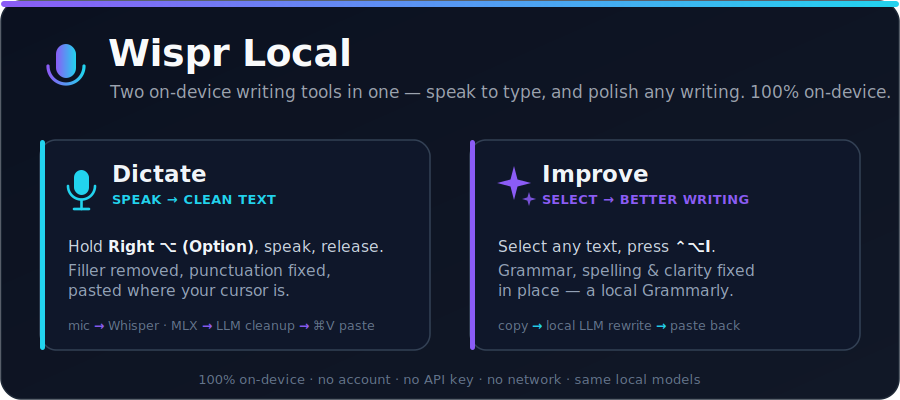

<div align="center">



<br/>

**Two on-device writing tools for Apple Silicon Macs: push-to-talk dictation + one-key writing improvement. Nothing leaves your machine.**

[](#requirements)
[](#requirements)
[](#why-wispr-local)
[](LICENSE)

</div>

---

## What it is

**Two on-device writing tools in one menu-bar app** — no account, no API key, no network.
Same local models, same privacy guarantee, two everyday jobs:

1. **Dictation** — a fully local clone of [Wispr Flow](https://wisprflow.ai). Hold a key, speak,
   release: Whisper transcribes, a local LLM strips filler and fixes punctuation, and the clean
   text is pasted straight into whatever app has focus.
2. **Writing improvement** — a local, one-key alternative to Grammarly. Select text *anywhere*,
   press **⌃⌥I** (Ctrl+Option+I), and the same local LLM fixes grammar, spelling, and clarity —
   pasting the polished version back over your selection.

**Dictation pipeline:** mic → [mlx-whisper](https://github.com/ml-explore/mlx-examples) (Metal-accelerated STT)
→ local LLM cleanup via [Ollama](https://ollama.com) (filler words, punctuation, self-corrections)
→ clipboard paste into the focused app.

**Improve pipeline:** selected text → local LLM rewrite via Ollama (grammar, spelling, clarity)
→ paste back over the selection (your original clipboard is saved and restored).

## Why Wispr Local

- **Two tools in one** — dictation *and* Grammarly-style writing improvement, sharing the same local models.
- **Private by design** — audio and text never leave the Mac. No cloud, no telemetry, no subscription.
- **Free** — pay $0/month instead of a SaaS dictation fee; runs on hardware you already own.
- **Fast** — Whisper runs on the Apple Neural Engine / Metal via MLX; cleanup is a small local model.
- **Works everywhere** — pastes into any focused app (editors, chat, browsers, terminals).
- **Yours to change** — ~1,600 lines of readable Python, MIT-licensed.

## Features

| | |
|---|---|
| 🎙️ **Push-to-talk** | Hold **Right ⌥ (Option)**, speak, release |
| ✍️ **Improve writing (⌃⌥I)** | Select any text, press **Ctrl+Opt+I** — local LLM fixes grammar & clarity in place (a local Grammarly) |
| 🔒 **Hands-free toggle** | Tap **Right ⌃ (Control)** to start, tap again to stop |
| ✨ **LLM cleanup** | Removes "um/uh", fixes punctuation and self-corrections |
| 🗣️ **Voice commands** | "new paragraph", "new line", "press enter" / "send message" |
| 📖 **Custom dictionary** | Whole-word replacements + biases Whisper toward your vocab |
| 🛡️ **Anti-hijack guard** | Discards LLM output that *answers* instead of *cleans* your dictation |
| 📊 **Live mic meter** | Floating pill shows input level while listening |
| 🍎 **Menu-bar app** | 🎙️ ready · 🔴 recording · ✨ transcribing/cleaning |

## Requirements

- Apple Silicon Mac (built/tested on M4 Pro, macOS 26)
- [Ollama](https://ollama.com) running, with the cleanup model pulled: `ollama pull qwen2.5:7b`
- `ffmpeg` (`brew install ffmpeg`)
- Python 3.11+ with the packages in `requirements.txt`

## Install & run

```bash
pip install -r requirements.txt
./run.sh
```

First launch downloads the Whisper model (~1.5 GB, one time) and warms both models —
the menu-bar icon shows ⏳ until ready (🎙️).

### Permissions (first run)

Grant both to the **terminal app you launch from** (Terminal/iTerm), not Python:

1. **Accessibility** — prompted at launch. Needed for the global hotkey and the synthetic ⌘V
   paste. System Settings → Privacy & Security → Accessibility. Relaunch after granting.
2. **Microphone** — prompted on first recording.

Stuck permissions during development: `tccutil reset Accessibility` / `tccutil reset Microphone`.

## Usage

| Action | Keys |
|---|---|
| Push-to-talk | **hold Right ⌥ (Option)**, speak, release |
| Hands-free toggle | **tap Right ⌃ (Control)** to start, tap again to stop |
| Improve selection | **select text, then press ⌃⌥I (Ctrl+Option+I)** |

Menu-bar icon: 🎙️ ready · 🔴 recording · ✨ transcribing/cleaning.
A floating pill shows the live mic level while listening.

### Improve any writing (Grammarly-style)

Select text in any app, then press **⌃⌥I (Ctrl+Option+I)** — or use menu → *✨ Improve selection*.
The selection is rewritten for grammar, spelling, and clarity by the local LLM and pasted back in
place. It **rewrites**, never answers: the same anti-hijack guard that protects dictation discards
any output that tries to *respond* to your text instead of polishing it, leaving the original
untouched. Your existing clipboard (including rich content like images) is saved and restored, and
the feature is skipped automatically in password fields (macOS secure input). The chord is chosen
so it won't collide with app shortcuts like ⌥⌘I devtools. Toggle it with `improve_enabled`.

### Voice commands

- "new paragraph" → blank line; "new line" / "next line" → line break
- End a dictation with **"press enter"** or **"send message"** → the phrase is stripped and
  Enter is pressed after pasting (great for chat apps)

### Custom dictionary

`~/.wispr-local/dictionary.json` (menu → *Edit dictionary…*):

```json
{ "rules": [ { "from": "wisper", "to": "Wispr" } ] }
```

Rules are whole-word, case-insensitive replacements applied after cleanup; the `to` values also
bias Whisper toward your vocabulary.

## Configuration

`~/.wispr-local/config.json` (created with defaults on first run):

- `stt_model` — default `mlx-community/whisper-large-v3-turbo`; use
  `mlx-community/whisper-small-mlx` for lower latency
- `llm_model` — default `qwen2.5:7b`; `qwen2.5:3b` is a faster fallback
- `stt_language` — `null` = autodetect, or e.g. `"en"`
- `improve_enabled` — turn the ⌃⌥I improve-selection feature on/off; `improve_temperature` (default `0.2`)
- `restore_delay`, `sounds`, `overlay_enabled`, `ptt_enabled`, `toggle_enabled`, …

Logs: `~/.wispr-local/wispr.log`.

## Tests & diagnostics

```bash
python3 diagnose.py            # environment + permission report
python3 tests/smoke_test.py    # pure-function tests (guard, commands, dictionary)
python3 tests/stt_test.py      # STT end-to-end via synthesized speech (no mic)
python3 tests/redteam_test.py  # verifies the LLM cleans dictation, never answers it
```

## Design notes

- **No pynput** — its global listener crashes on macOS 26 (Tahoe); hotkeys use
  `NSEvent.addGlobalMonitorForEventsMatchingMask` on the main thread instead.
- **Anti-hijack guard** — if the LLM tries to *answer* the dictation (the classic failure mode),
  a runtime length/preamble check discards it and pastes the raw transcript instead. If Ollama is
  down, dictation still works in raw mode.
- **Clipboard etiquette** — your previous clipboard is restored ~150 ms after the paste
  (plain-text contents only).
- Packaging as a real `.app` (py2app) would attach permissions to the app instead of the
  terminal — left as a future step.

## License

[MIT](LICENSE) © 2026 Mohammad Eissa

<sub>Not affiliated with or endorsed by Wispr Flow. Independent, from-scratch reimplementation for personal, on-device use.</sub>
